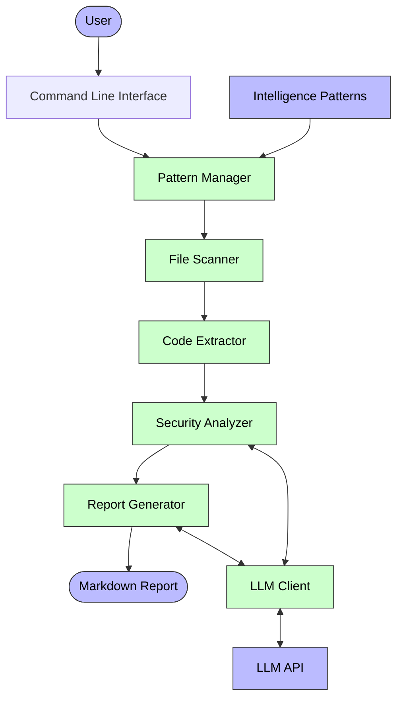

# GrepIntel

GrepIntel is a command-line tool for white-box security assessment. It automates the process of identifying potential security issues in source code by leveraging language-specific pattern matching and LLM-powered analysis.

## System Architecture



## Features

- Language-specific security pattern matching
- Automated source code extraction and analysis
- LLM-powered security vulnerability assessment
- Comprehensive security reports in multiple languages
- Support for multiple programming languages (PHP, Java, Python, JavaScript)
- Batch processing for efficient LLM analysis
- LLM interaction logging for debugging and analysis
- Framework-specific pattern matching (Laravel, Rails)

## Supported LLM Models

GrepIntel supports multiple LLM providers for security analysis:

| Provider | Default Model | Environment Variable |
|----------|---------------|----------------------|
| OpenAI   | gpt-4-turbo   | `LLM_PROVIDER=openai` |
| Claude   | claude-3-7-sonnet-20250219 | `LLM_PROVIDER=claude` |
| DeepSeek | deepseek-coder | `LLM_PROVIDER=deepseek` |
| Gemini   | gemini-2.0-flash-lite | `LLM_PROVIDER=gemini` |

To use a specific provider, set the `LLM_PROVIDER` environment variable and provide the corresponding API key in `LLM_API_KEY`. You can also specify a custom model by setting the `LLM_MODEL` environment variable:

## Installation

1. Clone the repository:
   ```
   git clone https://github.com/fujiokayu/grepIntel.git
   cd grepIntel
   ```

2. Create and activate a virtual environment:
   ```
   python -m venv venv
   source venv/bin/activate  # On Windows: venv\Scripts\activate
   ```

3. Install dependencies:
   ```
   pip install -r requirements.txt
   ```

4. Set up environment variables:
   ```
   cp .env.sample .env
   ```
   Edit the `.env` file to add your LLM API key and select your preferred LLM provider.

## Usage

Basic usage:

```
python -m src.main /path/to/target/directory --language php --output report.md
```

Advanced usage examples:

```bash
# Basic usage (scanning a PHP project)
python -m src.main /path/to/php/project --language php --output php_report.md

# Scanning multiple languages (PHP and JavaScript)
python -m src.main /path/to/web/project --language php javascript --output web_project_report.md

# Including framework-specific patterns
python -m src.main /path/to/rails/project --language ruby --framework rails --output rails_security_report.md

# Generating a Japanese report
python -m src.main /path/to/project --language java --report-language ja --output java_report_ja.md

# Enabling verbose logging
python -m src.main /path/to/project --language python --verbose --output python_report.md

# Adjusting batch size for large projects
python -m src.main /path/to/large/project --language go --batch-size 10 --output go_report.md

# Disabling LLM chat logging for privacy
python -m src.main /path/to/sensitive/project --language nodejs --no-log-chat --output nodejs_report.md

# Scanning a specific file only
python -m src.main /path/to/specific/file.php --language php --output single_file_report.md

# Combining multiple languages and frameworks
python -m src.main /path/to/fullstack/project --language php ruby --framework laravel rails --output fullstack_report.md
```

Options:

- `--language, -l`: Programming language(s) to scan for (php, java, python, javascript) - multiple languages can be specified
- `--framework, -f`: Framework to include specific patterns for (laravel, rails)
- `--output, -o`: Output report file (default: report.md)
- `--report-language`: Language for the generated report (en, ja)
- `--verbose, -v`: Enable verbose output
- `--no-log-chat`: Disable logging of interactions with LLM providers (logging is enabled by default)
- `--batch-size`: Number of vulnerabilities to analyze in a single batch (default: 5)

## Development

GrepIntel follows Test-Driven Development principles:

1. Install development dependencies:
   ```
   pip install -r requirements.txt
   ```

2. Run tests:
   ```
   pytest
   ```

3. Check code quality:
   ```
   flake8 src tests
   pylint src tests
   black --check src tests
   ```

## Contributing

GrepIntel's effectiveness relies heavily on its language-specific security patterns. We welcome contributions to expand and improve these patterns.

### Contributing Security Patterns

1. **Language Patterns**: Add or improve patterns in `intelligence/languages/[language].txt`
2. **Framework Patterns**: Add or improve patterns in `intelligence/frameworks/[framework].txt`

## License

[MIT License](LICENSE)
