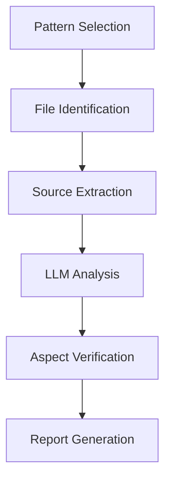

# System Patterns

## Architecture Overview
GrepIntel follows a pipeline architecture with distinct processing stages:

## Key Components
1. **Pattern Manager**: Maintains language-specific and framework-specific security grep patterns
2. **File Scanner**: Identifies files matching security patterns
3. **Code Extractor**: Retrieves full source code from identified files
4. **LLM Client**: Interfaces with various LLM providers
5. **Security Analyzer**: Processes LLM responses for specific security aspects
6. **Report Generator**: Compiles findings into comprehensive reports

## Implementation Status
- **Pattern Manager**: ✅ Implemented
- **File Scanner**: ✅ Implemented
- **Code Extractor**: ✅ Implemented
- **LLM Client**: ✅ Implemented
- **Security Analyzer**: 🔄 In Progress
- **Report Generator**: ⏳ Pending

## Design Patterns
- **Strategy Pattern**: For supporting multiple LLM providers
- **Pipeline Pattern**: For sequential processing of security analysis
- **Factory Pattern**: For creating appropriate scanners based on file types
- **Observer Pattern**: For monitoring and logging the analysis process

## Data Flow
1. User selects target directory and security aspects
2. System applies grep patterns to identify potential security issues
3. Full source code is extracted from identified files
4. Code is analyzed by LLM for security vulnerabilities
5. Results are verified across multiple security aspects
6. Comprehensive report is generated with findings and recommendations

## Code Extraction
The Code Extractor component has been implemented with the following features:
- Context-aware code extraction from identified vulnerabilities
- Configurable context window size for code snippets
- Structured data representation of extracted code
- LLM input formatting with token limit handling
- Support for multiple programming languages
- Error handling for file access and encoding issues
- Integration with the file scanning pipeline

## File Scanning
The File Scanner component has been implemented with the following features:
- Recursive directory traversal for finding target files
- File extension to language mapping
- Regular expression pattern matching for vulnerability detection
- Line number and context tracking for identified vulnerabilities
- Detailed vulnerability reporting with descriptions
- Support for both language-specific and framework-specific patterns
- Error handling for file access and encoding issues

## Pattern Management
The Pattern Manager component has been implemented with the following features:
- Loading patterns from text files with a specific format
- Organizing patterns by language, framework, and security aspect
- Providing access to patterns through a simple API
- Supporting multiple languages (currently PHP and Java)
- Supporting framework-specific patterns (currently Laravel and Rails)
- Hierarchical pattern management (language + framework)

## Command-line Interface
The CLI has been implemented with the following features:
- Target directory/file selection
- Language filtering
- Framework selection
- Output file specification
- Report language selection (English or Japanese)
- Verbose logging option
- Environment variable validation

## Development Workflow
GrepIntel follows Test-Driven Development principles:

1. **Red**: Write a failing test that defines the expected behavior
2. **Green**: Implement the minimum code needed to pass the test
3. **Refactor**: Clean up the code while maintaining test coverage
4. Repeat for each new feature or bug fix

## Quality Assurance
- Automated testing with pytest
- Minimum 80% test coverage enforced
- Linting with flake8 and pylint
- Code formatting with black
- CI/CD integration with GitHub Actions
